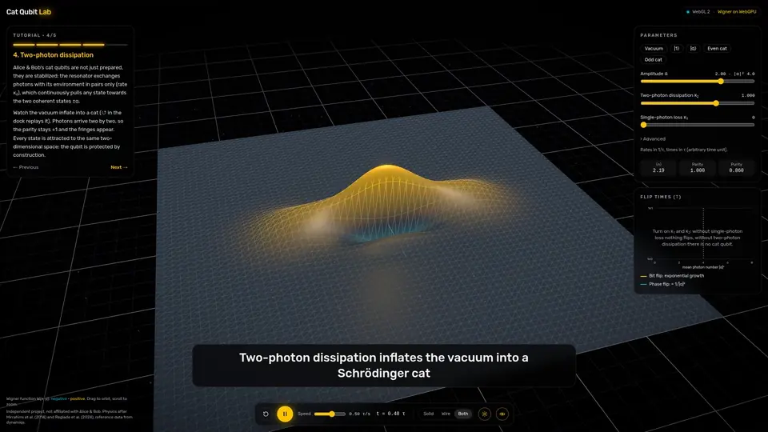

# cat-qubit-lab

An interactive lab for a dissipative cat qubit, running entirely in the browser. The density matrix
evolves under the Lindblad equation in Rust compiled to WebAssembly, and its Wigner function is
evaluated on the GPU by a WebGPU compute shader.

**[Live demo](https://dsanchez31.github.io/cat-qubit-lab/)** (requires WebGL 2, uses WebGPU when available)



## What it shows

A cat qubit stores information in two coherent states `|α⟩` and `|−α⟩` of a microwave resonator.
When the resonator exchanges photons with its environment in pairs only (two-photon dissipation),
every state is pulled towards the space spanned by these two states. Jumping from one to the other
(a bit flip) becomes exponentially unlikely as the mean photon number `|α|²` grows, while the
phase-flip rate grows only linearly. This bias is what lets cat-qubit architectures replace the 2D
surface code with a 1D repetition code.

The app walks through this in five steps: Fock states, coherent states, cat states, inflation of a
cat by two-photon dissipation, and the bit-flip / phase-flip trade-off.

The surface can be drawn solid, as a wireframe or both, with an optional glow. A dock at the bottom
plays, pauses and restarts the simulation, and a status pill shows whether the 3D view runs on WebGL 2
and whether the Wigner function is computed with WebGPU or on the CPU.

## Model

Single bosonic mode truncated to `N` Fock levels, Lindblad master equation with

| Jump operator | Rate | Effect |
| --- | --- | --- |
| `a² − α²` | `κ₂` | two-photon dissipation, stabilizes the cat manifold |
| `a` | `κ₁` | single-photon loss |
| `a†a` | `κφ` | pure dephasing |

- **Time evolution**: classical RK4, step bounded by a Gershgorin estimate of the Liouvillian
  spectral radius.
- **Wigner function**: expansion over the diagonals of `ρ` with normalized Laguerre functions
  (bounded by 1, so the same recurrence runs in `f32` on the GPU).
- **Flip times**: read from the Liouvillian spectrum rather than from a time-domain fit, since
  bit-flip times quickly exceed any simulable duration. With a real `α` the Liouvillian is real and
  block diagonal in the parity of `m − n`; the slowest mode of the odd block is the bit flip, the
  slowest non-stationary mode of the even block is the phase flip. Both are obtained by inverse
  iteration on a dense LU factorization.

## Validation

`reference/` generates reference data with [dynamiqs](https://github.com/dynamiqs/dynamiqs)
(time evolution with `mesolve`, Liouvillian spectrum with `slindbladian`, Wigner function), and
`crates/physics/tests/reference.rs` checks the Rust implementation against it.

## Layout

```
crates/physics        Rust library: operators, Lindblad solver, Wigner function, flip times
crates/physics-wasm   wasm-bindgen bindings
apps/web              React, react-three-fiber, WebGPU, Tailwind CSS
reference             dynamiqs reference data generator (uv)
docs/guide            background on the physics, the numerics and the code
```

## Running locally

Requirements: Rust (the toolchain is pinned in `rust-toolchain.toml`), `wasm-pack`, Node 24,
pnpm, and `uv` for the reference data.

```sh
pnpm install
pnpm build:wasm
pnpm dev
```

```sh
cargo test --workspace --release      # physics against dynamiqs
(cd reference && uv run generate)     # regenerate reference/data
```

WebGPU is used when available (recent Chromium-based browsers, Safari, Firefox on supported
platforms); otherwise the Wigner function is computed on the CPU at a lower resolution.

## References

- M. Mirrahimi et al., *Dynamically protected cat-qubits: a new paradigm for universal quantum
  computation*, New J. Phys. 16, 045014 (2014).
- R. Lescanne et al., *Exponential suppression of bit-flips in a qubit encoded in an oscillator*,
  Nat. Phys. 16, 509 (2020).
- U. Réglade et al., *Quantum control of a cat qubit with bit-flip times exceeding ten seconds*,
  Nature 629, 778 (2024), [arXiv:2307.06617](https://arxiv.org/abs/2307.06617).
- [dynamiqs](https://www.dynamiqs.org), GPU-accelerated open quantum systems simulation in JAX.

Independent project, not affiliated with or endorsed by Alice & Bob.

## License

Apache-2.0, see [LICENSE](LICENSE).
